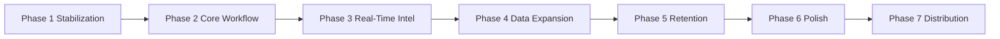

# 90-Day Execution Roadmap & Ship Strategy

Equilibrium transitions from broad architecture to **focused operational execution**. V1 foundation: **Hyperliquid-native execution + real-time market intelligence**.

Human trader central · AI organizes only · No autonomous trading · No feature bloat.

Related: [WEDGE_STRATEGY.md](./WEDGE_STRATEGY.md) · [MISSION.md](./MISSION.md)

---

## North star (90 days)

Launch a **genuinely useful institutional-grade crypto workflow** — not every Bloomberg feature at once.

| Priority | Defer |
|----------|--------|
| Operational usefulness | Excessive AI automation |
| Retention & reliability | Social / signal spam |
| Workflow + execution speed | Enterprise bureaucracy |
| Information clarity | Premature ecosystem sprawl |
| Institutional credibility | Complex portfolio OS (early) |

---

## Build order (strict)

| Phase | Window (indicative) | Goal |
|-------|---------------------|------|
| **1** | Days 1–21 | Daily-usable, production-stable terminal |
| **2** | Days 15–45 | Workflow superiority on HL desk |
| **3** | Days 30–60 | Differentiated operational visibility |
| **4** | Days 45–75 | Cross-venue intelligence (read-first) |
| **5** | Days 60–85 | Daily dependency (persistence, briefings) |
| **6** | Days 70–90 | Institutional feel |
| **7** | Days 75–90+ | Selected traders, retention validation |

Phases overlap intentionally; **do not start Phase N+2 until Phase N exit criteria are met.**

---

## Phase 1 — Stabilization (current)

**Goal:** Daily usable product.

| Workstream | Deliverables | Status |
|------------|--------------|--------|
| Runtime | No crash loops, clean unmount, boot guard | In progress |
| WebSocket | Reconnect, stale detection, tab-visibility recovery | In progress |
| Execution | Order guards (offline/stale book), clear errors | Shipped |
| Layout | Wedge V1 desk + EXPAND for full dev workspace | Shipped |
| Performance | Cap trade/intel buffers, defer heavy hooks in desk mode | Shipped |
| UX | Panel status (live/watch/offline), loading states | In progress |

**Exit criteria:** 5+ consecutive days internal use without blocking bugs; stream uptime perceived as reliable; orders never fire on stale feed.

---

## Phase 2 — Core workflow refinement

**Goal:** Workflow superiority on Hyperliquid.

- Execution workflow (ticket, 1CT, leverage, size presets)
- Intelligence tape quality and asset binding
- Order book / DOM / slippage radar cohesion
- Watchlists + asset switch (omnibar, keyboard)
- Alert rules (funding, spread, liq buffer)
- Workspace layout persistence per user
- Keyboard navigation map

**Exit criteria:** Median task time (switch asset → read book → submit) beats native HL UI + chart tab.

---

## Phase 3 — Real-time intelligence

**Goal:** Unique operational visibility (not prediction).

- Liquidation monitoring
- Whale / large trade context
- Funding regime shifts
- Volatility spikes
- Liquidity anomalies
- Venue divergence signals (HL-first)
- Market state engine (regime labels)

**Exit criteria:** Traders cite intel panels as reason to keep terminal open during session.

---

## Phase 4 — Data expansion

**Goal:** Cross-market intelligence advantage (read layer first).

Venues (priority order): Binance → Bybit → OKX → Coinbase → Deribit.

- Normalized ingest (existing pipeline)
- Cross-venue mids / funding / OI where available
- No multi-venue execution until Phase 2–3 are solid on HL

---

## Phase 5 — Retention & daily use

**Goal:** Habit and dependency.

- Saved workspaces (server + local)
- Persistent sessions
- Trader notes / journal linked to context
- Daily briefing (facts only, no trade calls)
- Personalized alerts
- Operational dashboard strip

---

## Phase 6 — Professional polish

**Goal:** Institutional feel.

- Typography, spacing, hierarchy (see [TERMINAL_EXPERIENCE.md](./TERMINAL_EXPERIENCE.md))
- Consistent loading / empty / degraded states
- Multi-monitor layout presets
- Calm mode, density, reduced motion (shipped — refine)

---

## Phase 7 — Early distribution

**Goal:** Real market validation.

- Onboard selected HL-native traders and small desks
- Workflow interviews, friction log
- Retention cohort tracking
- Pricing hypothesis (pro seat → desk)

---

## Success metrics (track weekly)

| Metric | Why |
|--------|-----|
| DAU / WAU | Adoption |
| Session duration | Dependency |
| D1 / D7 / D30 retention | Stickiness |
| Orders via terminal ticket | Execution wedge proof |
| Alert interactions | Intel utility |
| Layout save rate | Workflow embedding |
| Stream disconnect rate | Phase 1 health |

---

## What NOT to build yet

- Autonomous AI trading or “AI picks”
- Social / copy trading / signal feeds
- Full portfolio OS / treasury suite as hero
- Enterprise compliance theater
- Public API / developer ecosystem as GTM lead
- Full cross-venue execution before HL desk wins

Use **EXPAND** in the terminal for dev/review of later-phase panels — not as V1 default.

---

## V1 product surface (default)

**HL EXECUTION DESK** — hyperbook, chart, intelligence, ticket, positions, DOM, slippage, alerts, surveillance.

Ship order: stabilize → refine workflow → intel depth → venues → retention → polish → distribution.
