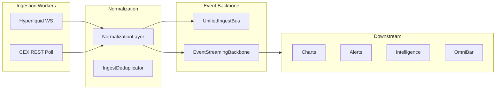

# Multi-Exchange Data Ingestion & Normalization (Phase 42)

Institutional market data backbone — aggregated, normalized, low-latency intelligence core.

## Architecture

## Exchange workers

| Exchange | Transport | Status |
|----------|-----------|--------|
| Hyperliquid | WebSocket | Live via terminal bridge |
| Binance | REST poll | Live top-of-book |
| Bybit | REST poll | Live + funding/OI |
| OKX | REST poll | Live + funding/OI |
| Coinbase | REST poll | Live top-of-book |
| Kraken | REST poll | Live top-of-book |
| Deribit | REST poll | Live perp + funding |

Orchestrator: `ExchangeIngestionOrchestrator`

## Unified schemas

- `UnifiedNormalizedTrade` — cross-venue trades
- `UnifiedNormalizedOrderBook` — bids/asks tuples
- `NormalizedFunding` / `NormalizedOpenInterest` — derivatives
- `NormalizedExchangeStatus` — venue health

See `src/types/data-ingestion.ts` and `src/types/market-data-backbone.ts`.

## Event streams

`EventStreamingBackbone` — internal abstraction (Kafka/NATS-ready):

- market · liquidity · intelligence · derivatives · macro · execution

## Storage tiers

| Tier | Backend | Role |
|------|---------|------|
| HOT | In-memory buffer | Real-time panels |
| WARM | PostgreSQL/Timescale (staged) | Analytics |
| COLD | S3 archives (staged) | Replay |

`StorageLayerRouter` reports tier status in DATA INGEST panel.

## Internal APIs

- `GET /api/market/vitals?asset=BTC`
- `GET /api/market/quotes?asset=BTC`
- `MarketDataInternalApi` — client-side facade

## Terminal UI

**DATA INGEST** panel → **WORKERS** · **STREAMS** tabs

Enabled via `useDataIngestion` in advanced workspace.

## Data quality

- Stale feed detection (`feed:stale` on ingest bus)
- Timestamp normalization (`TimestampNormalizer`)
- Duplicate suppression (`IngestDeduplicator`)
- Cross-venue intelligence (`CrossExchangeIntelligenceEngine`)

## Philosophy

Equilibrium does not own all raw data. Advantage = **fragmented crypto data → normalized, contextualized, operationally useful intelligence**.
